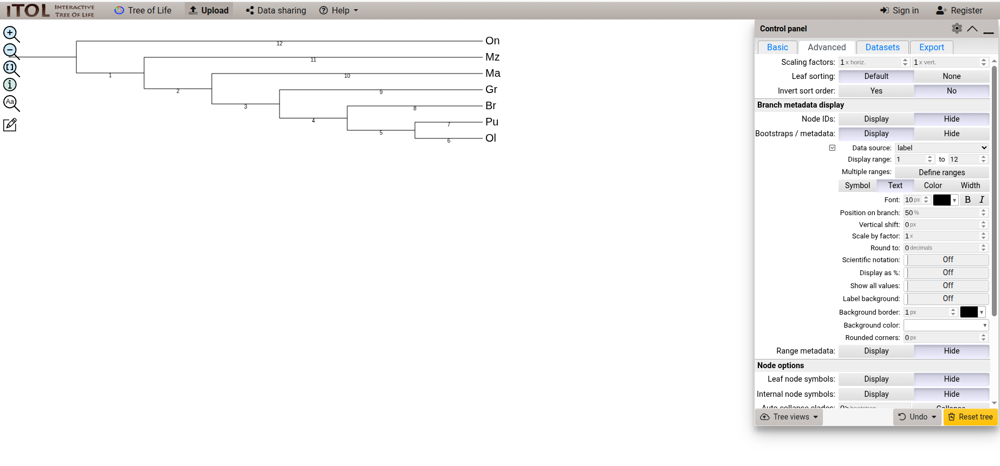
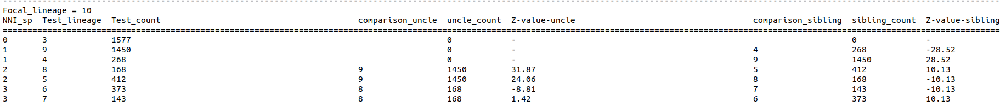
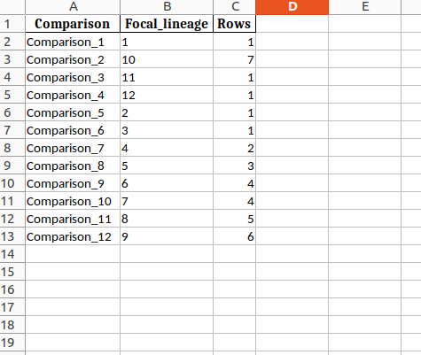
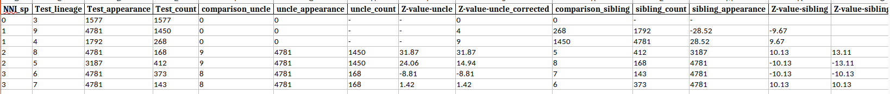
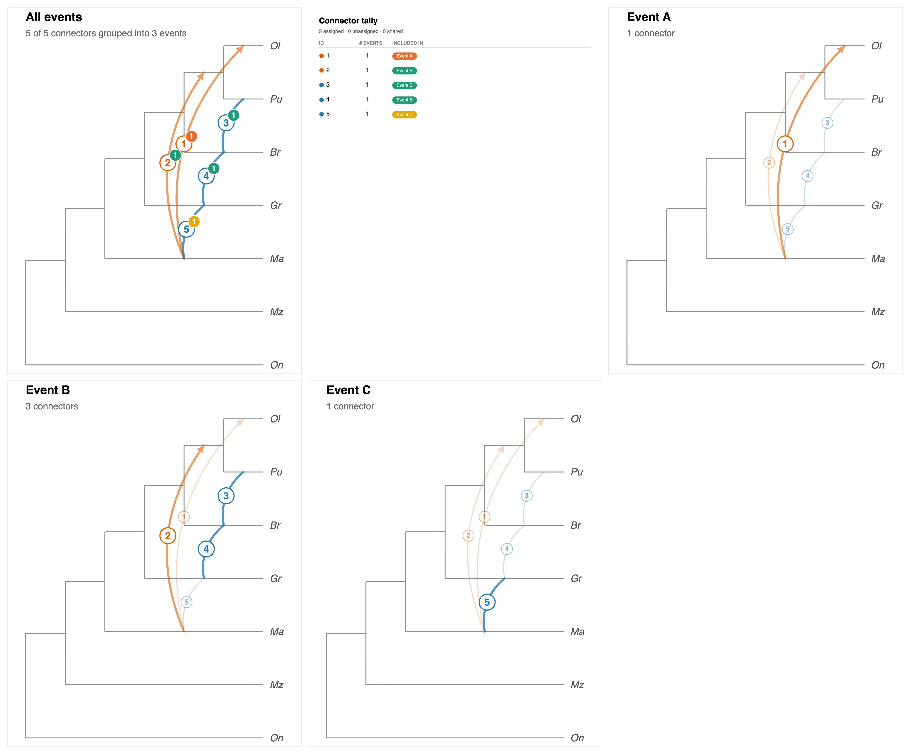

# Tutorial: Running DAFT on the Gante et al. cichlid dataset

This tutorial shows how we used DAFT and djiNNI on the Tanganyikan cichlid gene trees from Gante et al. [^1]. The goal is not only to reproduce the DAFT result, but also to show the full workflow to follow on a new dataset:

```text
get gene trees + species tree
format the gene trees for DAFT
run DAFT Test
extract significant branch-pairs
run DAFT Direction / djiNNI
interpret the result biologically
```

We intentionally walk through the extraction and formatting steps instead of only providing pre-formatted DAFT inputs.

---

## Requirements

Before starting, install DAFT and the Python packages needed by this tutorial [^3].

```bash
pip install -r requirements.txt
pip install .
pip install dendropy
```

The tutorial assumes you are working from the main `DAFT-main` repository folder.

---

## Step 1: Download the Gante et al. gene trees

Download the Gante et al. RAxML gene trees from Dryad [^3] (for your convience they're provided in ./dataset folder):

```text
https://datadryad.org/dataset/doi:10.5061/dryad.jr67t
```

Download the file called:

```text
raxml.trees
```

Place it in:

```text
Tutorial/dataset/raxml.trees
```

Next, create a species tree file called `Tutorial/dataset/sp_tree.tree` containing the rooted species tree used for this tutorial: `(On,(Mz,(Ma,(Gr,(Br,(Pu,Ol))))));`.

For this example, we use the gene trees and species-tree topology from the original paper.

For your own data, a typical workflow would be to reconstruct unrooted gene trees from a large set of homologous single-copy loci using a tool such as RAxML[^6] or IQ-TREE [^7], and then estimate a species tree using a species-tree estimation method such as ASTRAL[^8].

DAFT requires rooted gene trees with the same outgroup as the species tree. Alternatively, you can use DAFT to root the gene trees with `--rooting OUTGROUP --forced 1`.

*DAFT treats the supplied species tree as the "true" reference topology, so discordant attachments and introgression signals are interpreted relative to that tree.*


After this step, the tutorial dataset folder should contain:

```text
Tutorial/dataset/
├── raxml.trees
└── sp_tree.tree
```

For users applying this workflow to their own data, this is the first place to substitute their own files: replace `sp_tree.tree` with a rooted species tree and replace `raxml.trees` with their own gene tree file. Make sure the species names are the same in both sets of trees! (Shorter species names also work better for viewing the output.)

---

## Step 2: Convert the Gante gene trees into DAFT format

The downloaded Gante gene trees are in Nexus format. DAFT expects a  file with the first row, first column named `gt`, where each following row is one Newick gene tree in the first column.

We use the helper script:

```text
Tutorial/extract_gante.py
```

This script takes three arguments:

| Argument | Meaning |
|---|---|
| `path` | Path to the main DAFT folder so the script can find `DAFT_utils` |
| `input_file` | Input Nexus tree file |
| `output_file` | Output multi-tree format file for DAFT |

From the `DAFT-main/Tutorial` folder, run:

```bash
python extract_gante.py ../ dataset/raxml.trees dataset/Gante.tree
```

After this step, you should see:

```text
Tutorial/dataset/Gante.tree
```

The file should look like this:

```multi-tree format
((Ol,Pu),Br,...);
((Pu,Ol),Gr,...);
```

For users applying this workflow to their own data, the key requirement is that the final gene tree file must be a multi-tree format where each row is a gene tree.

---

## Step 3: Run DAFT Test without correction

Now we run DAFT Test. From the main `DAFT-main` folder, run:

```bash
daft-test \
  --sp_file "./Tutorial/dataset/sp_tree.tree" \
  --gt "./Tutorial/dataset/Gante.tree" \
  --output "gante" \
  --sibling 1 \
  --excel 1 \
  --direction 0
```

This runs DAFT Test only, with both avuncular and sibling tests (since the sibling option has been chosen here; the avuncular test always runs automatically). The output will be written to:

```text
DAFT_results_gante/
```

The most important files are:

| File | Meaning |
|---|---|
| `DAFT_Test_gante.txt` | Main DAFT Test output. This contains attachment counts and Z-scores for each focal lineage. |
| `DAFT_Test_gante.xlsx` | Excel version of the same output. This is often easier to inspect manually. |
| `branch_map.csv` | Key for translating numeric DAFT branch IDs back to biological lineages. |

The `branch_map.csv` file is important because DAFT labels branches using numeric IDs. These IDs are used throughout the output.

---

## Step 4: Understand the DAFT Test output

The beginning of `DAFT_Test_gante.txt` shows the labelled species tree:

```text
Species Tree = ((((((Ol[&label=6],Pu[&label=7])0[&label=5],Br[&label=8])0[&label=4],Gr[&label=9])0[&label=3],Ma[&label=10])0[&label=2],Mz[&label=11])0[&label=1],On[&label=12])0[&label=0];
```

Each number is a DAFT branch ID. For example:

| DAFT ID | Biological lineage |
|---:|---|
| `6` | `Ol` |
| `7` | `Pu` |
| `5` | `(Ol,Pu)` |
| `8` | `Br` |
| `9` | `Gr` |
| `10` | `Ma` |
| `11` | `Mz` |
| `12` | `On` |

It is helpful to plot this labelled tree before interpreting the output. One option is to paste the labelled species tree into iTOL [^4] and turn on branch labels. In iTOL, go to the advanced display options and show labels/metadata so that the DAFT branch IDs are visible.

The labelled tree should look like this:



The numbers on each branch correspond to the values used for the entries in `Focal_lineage`, `Test_lineage`, `comparison_uncle`, and `comparison_sibling` in the DAFT output.

---

## Step 5: Interpret one DAFT Test row

DAFT organizes results by focal lineage. Here is part of the output for `Focal_lineage = 10`, which corresponds to `Ma`:



One row from this table is:

```text
NNI_sp: 2
Test_lineage: 5
Test_count: 412
comparison_uncle: 9
uncle_count: 1450
Z-value-uncle: 24.06
comparison_sibling: 8
sibling_count: 168
Z-value-sibling: -10.13
```

Using the branch map, this means:

| DAFT column | Biological interpretation |
|---|---|
| `Focal_lineage = 10` | focal lineage is `Ma` |
| `Test_lineage = 5` | test lineage is `(Ol,Pu)` |
| `NNI_sp = 2` | `Ma` and `(Ol,Pu)` are 2 NNI moves apart in the species tree |
| `Test_count = 412` | 412 gene trees contain a discordant attachment between `Ma` and `(Ol,Pu)` |
| `comparison_uncle = 9` | the uncle comparison lineage is `Gr` |
| `uncle_count = 1450` | 1450 gene trees contain an attachment between `Ma` and `Gr` |
| `comparison_sibling = 8` | the sibling comparison lineage is `Br` |
| `sibling_count = 168` | 168 gene trees contain an attachment between `Ma` and `Br` |

DAFT uses Z-scores to test for significance. Negative values indicate that the test lineage attaches to the focal lineage more often than expected under the comparison. We use `-1.96` here as a simple threshold (this corresponds to a threshold of P<0.05 for a two-sided test).

For the avuncular (uncle) comparison:

```text
Z-value-uncle = 24.06
```

This is not significant in the introgression direction because it is positive.

For the sibling comparison:

```text
Z-value-sibling = -10.13
```

This is significant because it is less than `-1.96`. Therefore, DAFT identifies `Ma` and `(Ol,Pu)` as a candidate branch-pair.

Biologically, this does not yet tell us the direction of introgression. At this stage, DAFT Test is only saying that this pair shows an unusually high number of discordant attachments compared to the number of attachments between `Ma` and `Br`.

---

## Step 6: Extract significant DAFT Test pairs

We now scan the DAFT Test output for rows where either the uncle or sibling Z-score is less than or equal to `-1.96`.

Using this threshold, the significant focal/test rows are:

```text
Focal_lineage,Test_lineage
"(Ol,Pu);",Ma;
Ma;,Ol;
Ol;,Ma;
Br;,Pu;
Gr;,Br;
Ma;,Gr;
Ma;,"(Ol,Pu);"
```

Some pairs appear twice because the same pair can be significant when viewed from both focal directions. For example, `Ma` and `(Ol,Pu)` are significant both when `Ma` is the focal lineage and when `(Ol,Pu)` is the focal lineage.

After collapsing duplicates, we get five unique candidate branch-pairs:

```text
"(Ol,Pu);",Ma;
Ma;,Ol;
Br;,Pu;
Gr;,Br;
Ma;,Gr;
```

These are the candidate pairs we will pass to djiNNI / DAFT Direction.

Important: these are candidate branch-pairs, not automatically five independent biological introgression events. One biological event can sometimes produce several significant DAFT pairs because of tail effects, ghosted effects, or events involving internal branches.

---

## Step 7: Run DAFT Test with correction

The previous run used raw attachment counts. DAFT can also run in correction mode, which adjusts for how often a lineage appears across the gene tree dataset. The correction useful when there is missing data, lineage loss, or high ILS, because some branches may appear fewer times than others. 

However, we always recommend running DAFT first without correction, as these are more easily interpretable results. If your data has a lot of missing data (or very high ILS) you can run the correction, but **the most reliable results will always be significant both with and without correction.**

Run:

```bash
daft-test \
  --sp_file "./Tutorial/dataset/sp_tree.tree" \
  --gt "./Tutorial/dataset/Gante.tree" \
  --output "gante_correct" \
  --sibling 1 \
  --excel 1 \
  --direction 0 \
  --correct 1
```

The output is written to:

```text
DAFT_results_gante_correct/
```

The corrected text output can be wide, so the Excel file is often easier to inspect:

```text
DAFT_results_gante_correct/DAFT_Test_gante_correct.xlsx
```

The first sheet is a catalogue of all the other sheets: it tells you where to find everything. In this example, `Focal_lineage = 10` appears in `Comparison 2`.



The corrected output includes additional columns such as:

| Column | Meaning |
|---|---|
| `Test_appearance` | Number of gene trees where the test lineage appears, regardless of its attachment partner |
| `uncle_appearance` | Number of gene trees where the uncle lineage appears |
| `Z-value-uncle_corrected` | Uncle Z-score after correcting for lineage appearance |
| `sibling_appearance` | Number of gene trees where the sibling lineage appears |
| `Z-value-sibling_corrected` | Sibling Z-score after correcting for lineage appearance |

For the same `Focal_lineage = 10` (i.e. branch `Ma`), the appropriate sheet looks like this:



From the `Test_lineage = 5` row, we can see that the test lineage `(Ol,Pu)` appears 3187 times, while the uncle lineage `Gr` appears 4781 times. Since `(Ol,Pu)` appears fewer times overall, DAFT scales the comparison counts (attachments with `Ma`) before recomputing the corrected Z-score. It does not need to scale the test count since it appears fewer times.

For the uncle comparison:

```text
new_uncle_count = uncle_count * (Test_appearance / uncle_appearance)
                = 1450 * (3187 / 4781)
                = 966.57
```

The corrected uncle Z-score is then computed from the scaled count and the original test count.

For the sibling comparison, correction makes the signal even more negative:

```text
Z-value-sibling_corrected = -13.11
```

This remains significant.

⚠️ **Caution:** This is only a statistical correction. We recommend keeping significant pairs only when both the raw and corrected Z-scores are significant, to increase detection confidence and reduce false positives. For example: `Z-value-uncle <= -1.96` and `Z-value-uncle_corrected <= -1.96`, or `Z-value-sibling <= -1.96` and `Z-value-sibling_corrected <= -1.96`.


In this example, correction does not change the final set of significant pairs:

```text
"(Ol,Pu);",Ma;
Ma;,Ol;
Br;,Pu;
Gr;,Br;
Ma;,Gr;
```

---

## Step 8: Prepare significant pairs for DAFT Direction

DAFT Direction / djiNNI needs the significant pairs in a specific format.

Create this file:

```text
Tutorial/significant_pairs_gante.txt
```

with the following contents (i.e where each tuple represents a significant pair filtered above):

```python
[('Ma;', '(Ol,Pu);'), ('Ol;', 'Ma;'), ('Pu;', 'Br;'), ('Br;', 'Gr;'), ('Gr;', 'Ma;')]
```

These are the five unique candidate pairs from DAFT Test.

---

## Step 9: Run DAFT Direction / djiNNI

From the main `DAFT-main` folder, run:

```bash
daft-direction \
  --sp_file "./Tutorial/dataset/sp_tree.tree" \
  --gt "./Tutorial/dataset/Gante.tree" \
  --lineages_file "./Tutorial/significant_pairs_gante.txt" \
  --output "output_gante_direction"
```

The main output is:

```text
DAFT_results_output_gante_direction/DAFT_Direction_output_gante_direction.txt
```

---

## Step 10: Interpret DAFT Direction output

The DAFT Direction output begins by listing the pairs we passed in:

```text
SIGNIFICANT PAIRS
================================================================================
BETWEEN 5 AND 10                            2 NNI APART 
BETWEEN 10 AND 6                            3 NNI APART 
BETWEEN 8 AND 7                             1 NNI APART 
BETWEEN 8 AND 9                             1 NNI APART 
BETWEEN 9 AND 10                            1 NNI APART 
********************************************************************************
```

This table tells us the NNI distance between each significant pair in the species tree.

The key rule is:

| NNI distance | Interpretation |
|---:|---|
| `0` | Concordant/sister relationship in the species tree; direction is not inferred. |
| `1` | Significant pair, but DAFT Direction cannot infer donor/recipient. |
| `>1` | Eligible for djiNNI direction inference. |

In this example, only two pairs are more than 1 NNI apart:

```text
5 AND 10
10 AND 6
```

Therefore, only these two pairs appear in the djiNNI direction tables.

---

## Step 11: Interpret DATA TABLE1

```text
DATA TABLE1 (ONLY NNI > 1) 
====================================================================================
Significant_Pairs  Total_gene_trees  Lineage1  Count1  Lineage2  Count2  Major_Moved
====================================================================================
5 AND 10           412               5         221     10        191     5          
10 AND 6           373               10        164     6         209     6          
************************************************************************************
```

For pair `5 AND 10`:

| Column | Meaning |
|---|---|
| `Total_gene_trees = 412` | 412 gene trees contain the discordant attachment between lineages 5 and 10 |
| `Lineage1 = 5`, `Count1 = 221` | lineage 5 appears as the moved lineage in 221 trees |
| `Lineage2 = 10`, `Count2 = 191` | lineage 10 appears as the moved lineage in 191 trees |
| `Major_Moved = 5` | lineage 5 moved more often |

Since lineage 5 moved more often, djiNNI infers lineage 5 as the major recipient and lineage 10 as the major donor.

Using the branch map:

```text
5  = (Ol,Pu)
10 = Ma
```

So this row is interpreted as:

```text
recipient: (Ol,Pu)
donor: Ma
```

For pair `10 AND 6`:

```text
6  = Ol
10 = Ma
```

The inferred direction is:

```text
recipient: Ol
donor: Ma
```

---

## Step 12: Interpret the bidirectional table

```text
DATA TABLE2 (BIDIRECTIONAL) (ONLY NNI > 1) 
================================================================================================================
Significant_Pairs  Minor_Moved  Minor_sibling  Total_gene_trees  Minor_sibling_count  Minor_moved_count  Z_score
================================================================================================================
5 AND 10           10           -              -                 -                    191                -
10 AND 6           10           -              -                 -                    164                -
****************************************************************************************************************
```

This table asks whether there is evidence for bidirectional introgression. Because we only asked who moved *more* in DATA TABLE1, here we want to know if there is also evidence for introgression in the other direction.

To test this, djiNNI compares the minor-moved lineage (i.e. the one that was not named as the major recipient in DATA TABLE1) to an appropriate sibling lineage. In the Gante example, there is no valid sibling comparison for these pairs, so the table contains `-` values and no bidirectional conclusion is made. In other words, we cannot test for bidirectional introgression here.

This means the inferred relations are treated as unidirectional.

---

## Step 13: Final inferred relations

DAFT Direction summarizes the inferred relations as:

```text
INFERRED RELATIONS (ONLY NNI > 1) :
================================================================================
5 AND 10                  Recipient:5 AND Donor:10
10 AND 6                  Recipient:6 AND Donor:10
********************************************************************************
```

Translated back to biological lineages:

| DAFT relation | Biological interpretation |
|---|---|
| `Recipient:5 AND Donor:10` | `(Ol,Pu)` receives genetic material from `Ma` |
| `Recipient:6 AND Donor:10` | `Ol` receives genetic material from `Ma` |

The remaining significant pairs are still reported, but they are 1 NNI apart, so DAFT Direction cannot infer donor and recipient for them.

---

## Step 14: Plot the network

DAFT Direction also outputs an Extended Newick network, but ONLY FOR NNI>1 EVENTS:

```text
Network (ONLY NNI > 1) :  ((((((((Ol[&label=6])#H2,Pu[&label=7]))#H1,Br[&label=8]),Gr[&label=9]),((#H1,Ma[&label=10]),#H2)),Mz[&label=11]),On[&label=12]);
```

You can paste this Extended Newick string into an online network viewer such as IcyTree [^5]:

```text
https://icytree.org/
```

The plotted network should look like this:



---

## Step 15: Biological summary of the Gante example

DAFT Test identifies five candidate branch-pairs:

```text
(Ol,Pu) -- Ma
Ma -- Ol
Br -- Pu
Gr -- Br
Ma -- Gr
```

DAFT Direction can infer direction only for the two pairs that are more than 1 NNI apart:

```text
Ma -> (Ol,Pu)
Ma -> Ol
```

The other three pairs are 1 NNI apart. They may still be biologically informative, but DAFT Direction cannot determine donor and recipient for them.

⚠️ **Remember that DAFT significant pairs should be interpreted as candidate events. They are the starting point for biological interpretation, not automatically a one-to-one list of independent introgression events.**

---

## Step 16: Using this workflow on your own dataset

To adapt this tutorial to a new dataset, replace the Gante inputs with your own files:

| File to replace | Requirement |
|---|---|
| `Tutorial/dataset/sp_tree.tree` | Rooted, bifurcating species tree in Newick format |
| `Tutorial/dataset/Gante.tree` | multi-tree format file with one Newick gene tree per row |
| `Tutorial/significant_pairs_gante.txt` | Significant pairs extracted from your DAFT Test output |

The general workflow remains the same:

```text
1. Prepare a rooted species tree.
2. Prepare a gene tree multi-tree format  with one Newick gene tree per row .
3. Run DAFT Test.
4. Plot or inspect the labelled species tree so branch IDs are interpretable.
5. Extract significant focal/test pairs using a chosen Z-score threshold.
6. Run DAFT Direction on those pairs.
7. Interpret only NNI > 1 pairs as directionally inferable.
8. Treat NNI = 1 pairs as significant but direction-ambiguous.
```

This is the same logic used in the Gante example, but it can be applied to any dataset with a rooted species tree and a set of gene trees.

---


[^1]: Gante, H. F., Matschiner, M., Malmstrøm, M., Jakobsen, K. S., Jentoft, S., & Salzburger, W. (2016). Genomics of speciation and introgression in Princess cichlid fishes from Lake Tanganyika. *Molecular Ecology*, 25, 6143–6161. [doi:10.1111/mec.13767](https://doi.org/10.1111/mec.13767)

[^2]: Gante, H. F., Matschiner, M., Malmstrøm, M., Jakobsen, K. S., Jentoft, S., & Salzburger, W. (2016). Data from: Genomics of speciation and introgression in Princess cichlid fishes from Lake Tanganyika. Dryad. [doi:10.5061/dryad.jr67t](https://doi.org/10.5061/dryad.jr67t)

[^3]: Sukumaran, J., & Holder, M. T. (2010). DendroPy: A Python library for phylogenetic computing. *Bioinformatics*, 26, 1569–1571. [doi:10.1093/bioinformatics/btq228](https://doi.org/10.1093/bioinformatics/btq228)

[^4]: Letunic, I., & Bork, P. (2021). Interactive Tree Of Life (iTOL) v5: An online tool for phylogenetic tree display and annotation. *Nucleic Acids Research*, 49, W293–W296. [doi:10.1093/nar/gkab301](https://doi.org/10.1093/nar/gkab301)

[^5]: Vaughan, T. G. (2017). IcyTree: Rapid browser-based visualization for phylogenetic trees and networks. *Bioinformatics*, 33, 2392–2394. [doi:10.1093/bioinformatics/btx155](https://doi.org/10.1093/bioinformatics/btx155)

[^6]: Kozlov, A. M., Darriba, D., Flouri, T., Morel, B., & Stamatakis, A. (2019). RAxML-NG: A fast, scalable and user-friendly tool for maximum likelihood phylogenetic inference. *Bioinformatics*, 35, 4453–4455. [doi:10.1093/bioinformatics/btz305](https://doi.org/10.1093/bioinformatics/btz305)

[^7]: Wong, T. K. F., Ly-Trong, N., Ren, H., Demotte, P., Baños, H., Roger, A. J., Susko, E., Bielow, C., De Maio, N., Goldman, N., Hahn, M. W., dos Reis, M., Vinh, L. S., Huttley, G., Lanfear, R., & Minh, B. Q. (2026). IQ-TREE 3: Phylogenomic inference software using complex evolutionary models. *Molecular Biology and Evolution*, 43(5), msag117. [doi:10.1093/molbev/msag117](https://doi.org/10.1093/molbev/msag117)

[^8]: Zhang, C., Rabiee, M., Sayyari, E., & Mirarab, S. (2018). ASTRAL-III: Polynomial time species tree reconstruction from partially resolved gene trees. *BMC Bioinformatics*, 19(Suppl 6), 153. [doi:10.1186/s12859-018-2129-y](https://doi.org/10.1186/s12859-018-2129-y)

